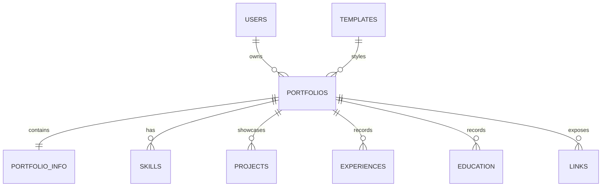

# PortFold

PortFold is an online portfolio generator. A user enters their professional information, chooses one of three portfolio designs, previews the result, and can edit, delete, or export their portfolio.

**Live site:** [https://portfold.onrender.com](https://portfold.onrender.com)

### Deployment status — 2026-10-05

Render first timed out commit `393a6a9` after 15 minutes 31 seconds. The Docker build and database startup completed, but the dashboard had no HTTP health-check path even though `render.yaml` specifies `/up`. I set the Render path to `/up`; the retry for the same commit then deployed successfully in 46.6 seconds, and Render received HTTP 200 from `/up`. The home, login, registration, and email-confirmation routes also returned HTTP 200 in a read-only smoke check. See the [QA checklist](docs/QA-CHECKLIST.md) for test limits and remaining manual checks. Render may cancel a deploy if the new instance does not pass health checks within 15 minutes ([health-check behavior](https://render.com/docs/health-checks)).

**Source code:** [https://github.com/johnfrancisprimor21-tech/PortFold](https://github.com/johnfrancisprimor21-tech/PortFold)

## Features

- Create a portfolio with a profile photo, contact details, location, biography, skills, education, experience, projects, and social links.
- Choose from three distinct Blade templates: **Simple**, **Modern**, and **Creative**.
- Preview a portfolio publicly and manage it from an authenticated account.
- Edit and delete portfolios; portfolio owners are checked by the server.
- Export portfolio data as JSON or download a rendered HTML snapshot.
- Use Supabase Auth for account sessions and Supabase PostgreSQL for portfolio data. Supabase Storage stores profile and project images.
- Switch theme where supported by the selected template.

## Technology

| Area | Technology |
| --- | --- |
| Server application | PHP 8.3+, Laravel 13, Blade |
| Frontend build | Vite 8, Tailwind CSS 4 |
| Interactive creative scene | Three.js |
| Authentication | Supabase Auth, including Google OAuth when configured |
| Database | Supabase PostgreSQL |
| Image storage | Supabase Storage |
| Hosting | Render Docker web service |

## User flow

1. Open the home page and sign in or create an account.
2. Enter portfolio information and save it.
3. Select Simple, Modern, or Creative.
4. Preview and share the public portfolio page.
5. Return to Manage to edit, delete, or export the portfolio.

Portfolio creation and management require an authenticated account. Public portfolio pages are read-only.

## Local development

### Prerequisites

- PHP 8.3 or newer with the extensions required by Laravel and PostgreSQL.
- Composer.
- Node.js and npm.
- Access to a Supabase project configured with the PortFold database schema, Auth, and Storage buckets.

### Setup

```powershell
composer install
Copy-Item .env.example .env
php artisan key:generate
npm ci
npm run build
```

Set the local environment values in `.env` before starting the application. Do not use production credentials for local development or commit `.env`.

```powershell
php artisan serve
```

Open `http://127.0.0.1:8000`.

### Database setup caveat

The hosted Supabase database is already provisioned, but the repository currently does **not** contain migrations that create all portfolio-domain tables (`templates`, `portfolios`, `portfolio_info`, `skills`, `projects`, `education`, `experiences`, and `links`). The ownership migration expects the existing `portfolios` table. `DatabaseSeeder` inserts the three template rows only after the `templates` table exists.

For a fresh database, `php artisan migrate` alone is therefore not a complete setup. Use the established Supabase schema, and verify or add versioned migrations/schema setup before expecting a clean installation to work. See [Project documentation](docs/PROJECT-DOCUMENTATION.md) for the current logical data model and [QA checklist](docs/QA-CHECKLIST.md) for the checks that remain.

## Configuration

Configure these values in the local `.env` or the hosting provider's private environment-variable settings. The repository intentionally contains no live values.

| Variable | Purpose |
| --- | --- |
| `APP_KEY` | Laravel encryption key |
| `APP_URL` | Canonical app URL |
| `DB_CONNECTION` | Set to `pgsql` for Supabase PostgreSQL |
| `DB_HOST`, `DB_PORT`, `DB_DATABASE`, `DB_USERNAME`, `DB_PASSWORD` | PostgreSQL connection settings |
| `DB_SSLMODE` | PostgreSQL TLS mode; the hosted configuration uses `require` |
| `SUPABASE_URL` | Supabase project URL |
| `SUPABASE_ANON_KEY` | Public Supabase key used by the browser auth client |
| `SUPABASE_SERVICE_KEY` | Server-only key used by trusted server storage operations |
| `SESSION_DRIVER`, `SESSION_ENCRYPT`, `SESSION_SECURE_COOKIE` | Session storage and cookie settings |

Never expose `SUPABASE_SERVICE_KEY`, database credentials, or `APP_KEY` to browser code, source control, screenshots, or project submissions. `.env` is ignored by Git. Use only the public/anon key in browser configuration.

### Google sign-in

Google sign-in requires Google OAuth credentials configured in Supabase Auth. Register the Supabase Auth callback shown in the Supabase provider settings with Google Cloud. Set Supabase's application Site URL to the deployed PortFold URL and allow `https://portfold.onrender.com/auth/callback` as a redirect URL. If the Google consent screen remains in Testing mode, add the evaluator's Google account as a test user.

## Database overview

The logical data model is:



This diagram describes the relationships used by the application. It is not a substitute for a checked-in migration or a schema dump: verify actual foreign keys, uniqueness, nullability, and delete behavior in Supabase. The documented field summary is in [Project documentation](docs/PROJECT-DOCUMENTATION.md).

## Tests and build

Run the existing automated suite:

```powershell
php artisan test
```

Build frontend assets:

```powershell
npm run build
```

The test suite includes Supabase-authentication checks and portfolio edit/save regression checks. A passing local suite does not prove that production Google OAuth, Supabase Storage, or every live database operation works; use the [QA checklist](docs/QA-CHECKLIST.md) for the manual release walkthrough.

## Deployment

The repository includes `Dockerfile` and `render.yaml` for a Render web service. The service is configured to build the Vite assets, use Supabase PostgreSQL over TLS, and expose Laravel's `/up` health endpoint. Render's environment variables must be configured privately. Confirm the domain and Supabase redirect settings after deployment.

## Project and QA documents

- [Project documentation](docs/PROJECT-DOCUMENTATION.md) — overview, requirements mapping, data model, hosting, and submission checklist.
- [QA checklist](docs/QA-CHECKLIST.md) — automated evidence, deployment smoke checks, and manual test cases.
- [Prototype and issue log](docs/PROTOTYPE-AND-ISSUE-LOG.md) — design iterations, reported problems, and current verification status.

## Template screenshots

These screenshots use synthetic demo content (`Alex Rivera`, `example.test`) and do not show a real user's portfolio.

| Simple — light | Simple — dark |
| --- | --- |
|  |  |

| Modern — neomorphic | Creative — cosmic scene |
| --- | --- |
|  |  |

## System screenshot


