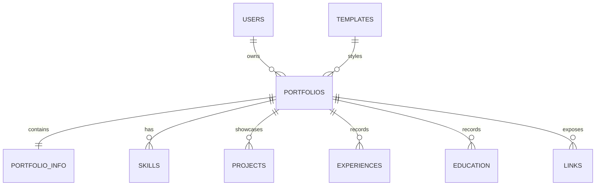
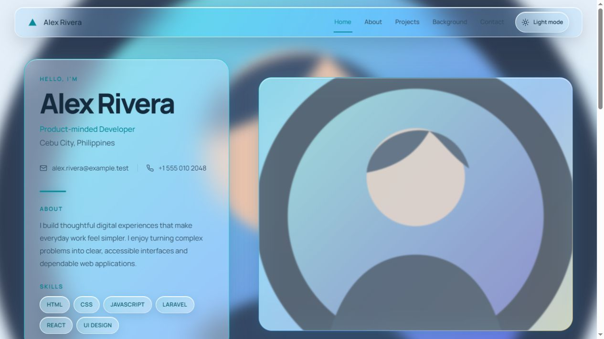
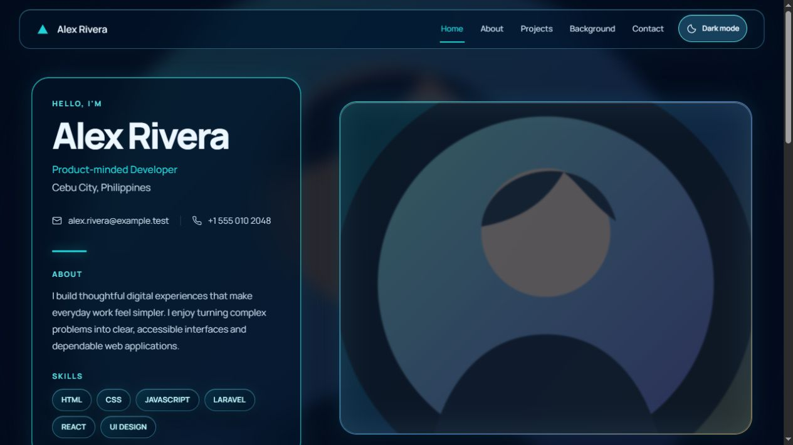
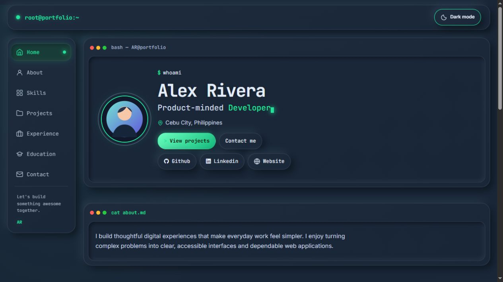
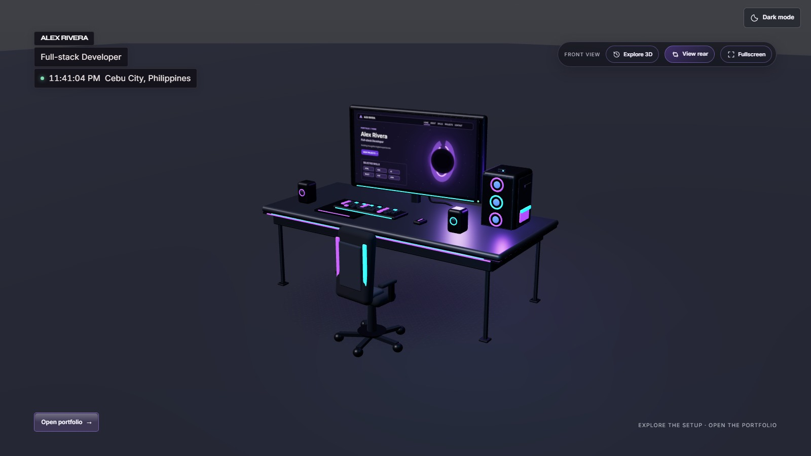
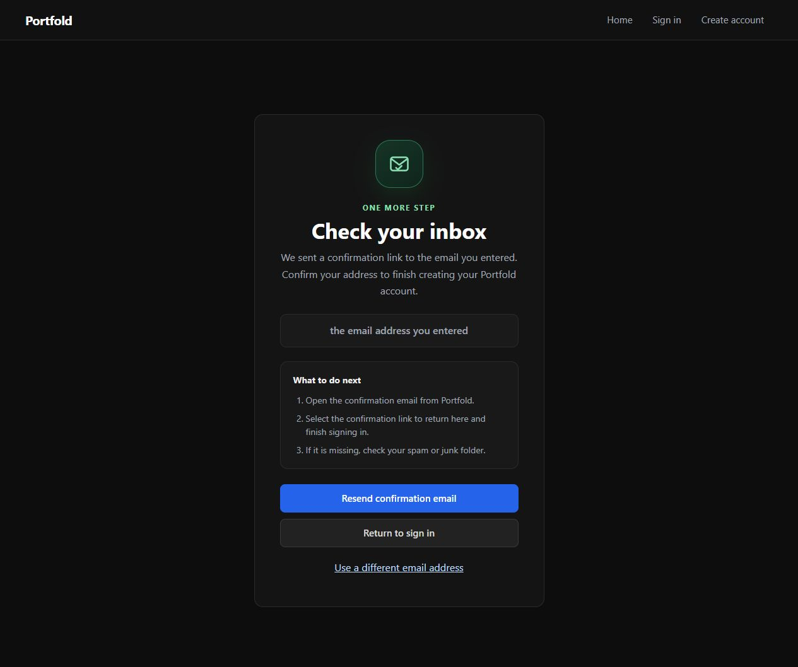
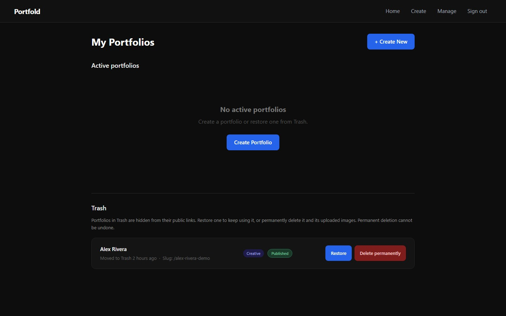

# PortFold

PortFold is a portfolio builder built with Laravel, Supabase, and three portfolio designs: **Simple**, **Modern**, and **Creative**. Users can create, preview, edit, export, publish, and manage portfolios from an authenticated account.

**Live site:** [portfold.onrender.com](https://portfold.onrender.com)

**Source:** [github.com/johnfrancisprimor21-tech/PortFold](https://github.com/johnfrancisprimor21-tech/PortFold)

## Features

- Create portfolios with profile details, skills, projects, education, experience, and links.
- Preview Simple, Modern, and Creative templates. Creative includes an interactive Three.js workstation with front/rear views and orbit controls.
- Edit a portfolio and download JSON or a standalone HTML export.
- Move a portfolio to **Trash**, restore it, or permanently delete it.
- Permanent deletion is owner-only and available for items already in Trash. It removes the portfolio rows and attempts to remove its Supabase Storage images, while preserving image URLs shared with another portfolio.
- Supabase Auth handles email/password and configured Google sign-in. Laravel maintains the application session and enforces ownership.

### Public page visibility

Portfolio preview and public-page routes do not require a login. A URL is therefore a share link, not private access control. Trashing a portfolio makes its public routes unavailable; restoring it makes the URL active again. Do not put information in a portfolio that should remain private.

## Technology

| Area | Technology |
| --- | --- |
| Server | PHP 8.3+, Laravel 13, Blade |
| Frontend | Vite 8, Tailwind CSS 4, JavaScript |
| 3D scene | Three.js |
| Authentication | Supabase Auth, Google OAuth when configured |
| Database and media | Supabase PostgreSQL and Supabase Storage |
| Hosting | Render Docker web service |

## Local development

### Requirements

- PHP 8.3 or newer with Laravel's required extensions and PostgreSQL support
- Composer, Node.js, and npm
- A Supabase project with the PortFold schema, Auth configuration, and Storage buckets

### Install and run

```powershell
composer install
Copy-Item .env.example .env
php artisan key:generate
npm ci
npm run build
php artisan serve
```

Set the database and Supabase environment values in `.env` before opening `http://127.0.0.1:8000`. Keep `.env` and production credentials out of Git. To check the app on a phone on the same LAN, bind the development server to `0.0.0.0` and visit the computer's LAN IPv4 address (for example, `http://192.168.1.5:8000`); `0.0.0.0` is a bind address, not a browser destination. Firewall, router isolation, and Wi-Fi/LAN configuration can still block the phone.

### Database setup caveat

The repository does not yet contain baseline create-table migrations for all portfolio-domain tables. The checked-in migrations expect the existing Supabase schema; the `deleted_at` migration only adds the recoverable-deletion column and index to an existing `portfolios` table. A clean empty Supabase project cannot be provisioned with `php artisan migrate` alone. See the [database and authentication guide](docs/DATABASE-AND-AUTHENTICATION-GUIDE.docx) and [project documentation](docs/PROJECT-DOCUMENTATION.md) for the checked schema snapshot and remaining setup gap.

## Configuration and security

Configure environment variables in `.env` locally or in the hosting provider's private settings. The repository intentionally contains no live values.

| Variable | Purpose |
| --- | --- |
| `APP_KEY`, `APP_URL` | Laravel encryption and canonical URL |
| `DB_CONNECTION`, `DB_HOST`, `DB_PORT`, `DB_DATABASE`, `DB_USERNAME`, `DB_PASSWORD`, `DB_SSLMODE` | PostgreSQL connection; use TLS for hosted Supabase |
| `SUPABASE_URL`, `SUPABASE_ANON_KEY` | Browser auth client configuration |
| `SUPABASE_SERVICE_KEY` | Server-only privileged Storage operations |
| `SESSION_DRIVER`, `SESSION_ENCRYPT`, `SESSION_SECURE_COOKIE` | Session persistence and cookie settings |

Never expose the service key, database credentials, or `APP_KEY` to browser code, screenshots, Git, or submitted docs. Google sign-in also depends on Supabase and Google Cloud OAuth configuration, allowed callback URLs, and the OAuth test-user list when the consent screen is in testing mode.

## Database at a glance



The diagram summarizes application relationships. It is not a schema dump; actual constraints are documented separately in the database guide. The Supabase Auth identity UUID is mirrored to `public.users` and is used as the portfolio owner key.

## Documentation and QA

- [Project documentation](docs/PROJECT-DOCUMENTATION.md) — scope, architecture, routes, data model, hosting, and submission notes.
- [QA checklist](docs/QA-CHECKLIST.md) — historical checks plus manual release cases and current verification limits.
- [Prototype and issue log](docs/PROTOTYPE-AND-ISSUE-LOG.md) — design iterations, user-reported problems, and unresolved findings.
- [Database and authentication guide](docs/DATABASE-AND-AUTHENTICATION-GUIDE.docx) — full table and authentication architecture guide.

## Screenshots

Screenshot data is synthetic. Images are visual documentation, not proof that a feature passed deployed, mobile, or accessibility QA.

| Simple light | Simple dark |
| --- | --- |
|  |  |

| Modern | Creative workstation |
| --- | --- |
|  |  |

| Email confirmation | Manage and Trash |
| --- | --- |
|  |  |

## Build and tests

```powershell
npm run build
php artisan test
```

The automated suite does not establish that live Google OAuth, email delivery, Supabase Storage cleanup, phone-on-LAN access, or every deployed database operation works. Review the [QA checklist](docs/QA-CHECKLIST.md) for recorded evidence and pending checks.

## Deployment

The project includes `Dockerfile` and `render.yaml` for Render. Set production credentials privately, keep the `/up` health-check path configured, and confirm Supabase callback URLs after changing domains. Render may take longer to respond after an idle period on its free service tier.
